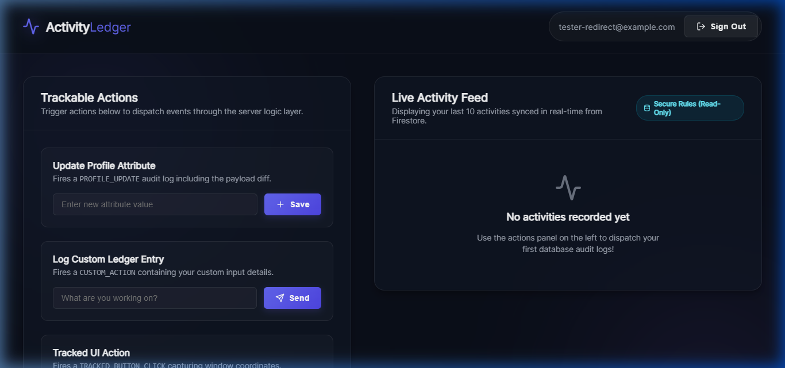
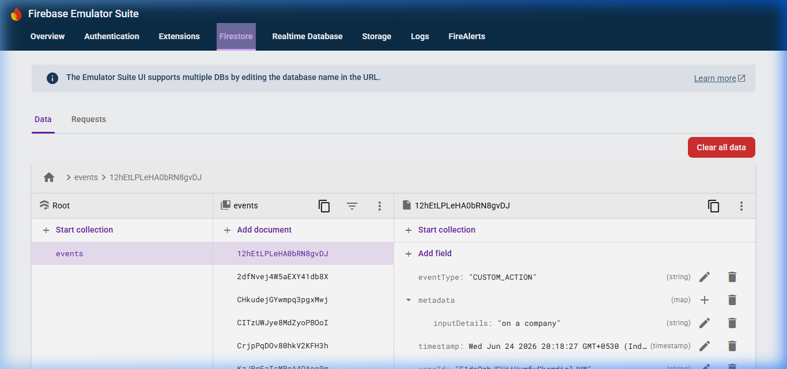

# User Activity Ledger App

A secure user activity ledger application containing a React + TypeScript frontend (inside `/client`), a Node + Express backend logic layer (inside `/server`), and a Firestore database. The application is pre-configured to run completely offline using local Firebase Emulators (Authentication, Firestore, and Emulator UI).

## Architecture & Security Model

To satisfy the requirements and follow platform engineering security best practices:
1. **Server-Side Event Writing**: The client React SDK has **zero** write access to Firestore. All activity event logs are generated and written to the database via the Express backend server, which validates the Firebase ID token in the authorization header and writes the document using the Firebase Admin SDK.
2. **Secure Direct Reading**: The client React application reads/listens to its own events feed directly from Firestore. This is governed by a strict Firestore Security Rule (`firestore.rules`) ensuring that authenticated users can only view their own records (`resource.data.userId == request.auth.uid`), preventing any unauthorized database access.

---

## Directory Layout

```
activity-ledger-app/
├── client/                 # Vite React frontend application (TypeScript)
│   ├── src/                # Frontend source code
│   │   ├── App.tsx         # Dashboard, login card, actions, and real-time feed
│   │   ├── firebase.ts     # Firebase client setup & Emulator configuration
│   │   ├── types.ts        # Shared TypeScript ledger interfaces
│   │   └── App.css         # Glassmorphic dark styling stylesheet
│   ├── public/             # Static public assets
│   ├── index.html          # Frontend page entry
│   ├── vite.config.ts      # Vite configuration
│   └── package.json        # Frontend specific packages (react, firebase SDK)
├── server/                 # Express backend server (TypeScript)
│   ├── src/index.ts        # Token verification middleware and POST endpoint
│   ├── package.json        # Backend specific packages (express, firebase-admin)
│   └── tsconfig.json       # Backend TypeScript configuration
├── docs/                   # Assignment written tasks and reflections
│   ├── explanation.md      # Part 2: Database structure, scaling & shortcuts
│   ├── critique.md         # Part 3: Platform engineering audit of thinktac.com
│   └── reflection.md       # Part 4: MERN vs Firebase comparison & observability
├── firebase.json           # Firebase Emulator configurations
├── firestore.rules         # Security Rules (read-only for owner, write-blocked)
├── firestore.indexes.json  # Database indexes config
├── package.json            # Root orchestrator scripts and emulator tooling
└── README.md               # Setup and execution guide (this file)
```

---

## Application Screenshots

### Client Dashboard UI


### Firebase Emulator Firestore DB UI


---

## Setup & Running Locally

### Prerequisites
- Node.js (v18 or higher)
- Java Runtime Environment (JRE) installed (Required by the Firebase Emulator Suite)

### Installation

1. Clone or download the repository files.
2. Install orchestrator dependencies in the root directory:
   ```bash
   npm install
   ```
3. Install frontend client packages in the `/client` directory:
   ```bash
   cd client
   npm install --legacy-peer-deps
   cd ..
   ```
4. Install backend server packages in the `/server` directory:
   ```bash
   cd server
   npm install
   cd ..
   ```

### Running the Complete Application

Run the following command in the root project directory:
```bash
npm run dev:all
```

This starts:
- **Firebase Emulator UI**: [http://localhost:4000](http://localhost:4000) (View simulated database records in real-time)
- **Vite React Frontend**: [http://localhost:5173](http://localhost:5173) (Open this in your browser to interact with the application)
- **Express Backend Server**: [http://localhost:3001](http://localhost:3001)

### Alternate Command Execution (Individual processes)

If you prefer to run services in separate terminals, execute the following from the root directory:
- **Start Emulators**: `npm run emulators`
- **Start Backend Server**: `npm run server`
- **Start React Frontend**: `npm run client`

---

## Assignment Artifacts

Below are the written portions of this assignment:
- **Written Explanation (Part 2)**: [docs/explanation.md](file:///c:/Users/Deepa%20DS/Desktop/My-projects/activity-ledger-app/docs/explanation.md)
- **Review and Critique (Part 3)**: [docs/critique.md](file:///c:/Users/Deepa%20DS/Desktop/My-projects/activity-ledger-app/docs/critique.md)
- **Short Reflection (Part 4)**: [docs/reflection.md](file:///c:/Users/Deepa%20DS/Desktop/My-projects/activity-ledger-app/docs/reflection.md)
